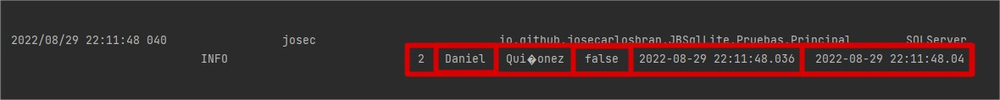
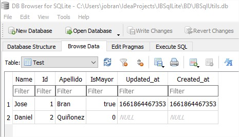
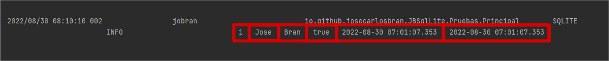
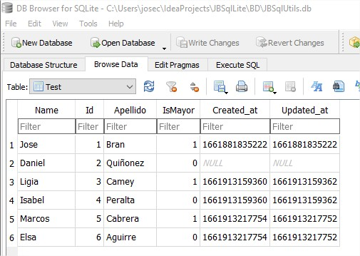
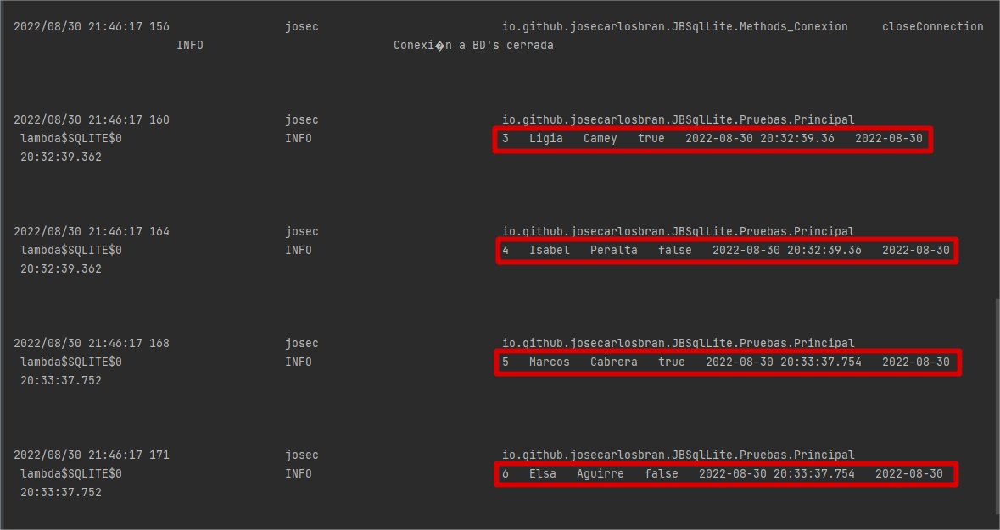

## ¿Cómo refrescar un modelo con la información de la tabla que representa en BD's?

Para poder refrescar un modelo obteniendo la información de la tabla que representa
en BD's, si esta existe y que columnas posee, podemos hacerlo a través del método
refresh

~~~
/**
* Metodo que actualiza la información que el modelo tiene sobre lo que existe en BD's'
*/
this.testModel.refresh();
~~~

* * *

## ¿Cómo eliminar la tabla correspondiente a un modelo?

Para poder eliminar la tabla correspondiente a un modelo únicamente necesitamos crear una
instancia del mismo y llamar al método dropTableIfExist().

~~~
/**
* Instanciamos el modelo
*/
Test testModel = new Test();

/**
* Elimina la tabla correspondiente al modelo en BD's
* @return True si la tabla correspondiente al modelo en BD's existe y fue eliminada, de no existir la tabla correspondiente
* en BD's retorna False.
*/
testModel.dropTableIfExist();
~~~

* * *

## ¿Cómo crear la tabla correspondiente a un modelo?

Para poder crear la tabla correspondiente a un modelo únicamente necesitamos crear una
instancia del mismo y llamar al método crateTable().

~~~
/**
* Instanciamos el modelo
*/
Test testModel = new Test();

/**
* Crea la tabla correspondiente al modelo en BD's si esta no existe.
* @return True si la tabla correspondiente al modelo en BD's no existe y fue creada exitosamente,
* False si la tabla correspondiente al modelo ya existe en BD's
*/
testModel.crateTable();
~~~

Por default la tabla correspondiente al modelo, incluirá las columnas created_at y update_at

Si deseamos que JBSqlUtils no gestione las columnas created_at y update_at, al momento de crear la tabla,
insertar o actualizar un registro, basta con llamar el método setTimestamps(false), enviando cómo parametro true
si queremos que JBSqlUtils gestione las columnas o false si queremos que JBSqlUtils No gestione estas columnas.
por default JBSqlUtils esta configurada para manejar la columnas created_at y update_at.

~~~
/**
* Setea la bandera que define si el modelo desea que JBSqlUtils maneje las timestamps Created_at, Update_at.
* @param timestamps True si las timestamps serán manejadas por JBSqlUtils, False, si el modelo no tiene estas
*          columnas.
*/
testModel.setTimestamps(false);

/**
* Crea la tabla correspondiente al modelo en BD's si esta no existe.
* @return True si la tabla correspondiente al modelo en BD's no existe y fue creada exitosamente,
* False si la tabla correspondiente al modelo ya existe en BD's
*/
testModel.crateTable();
~~~

* * *

## ¿Cómo almacenar un modelo en BD's?

Para poder insertar un modelo en la tabla correspondiente al mismo en BD's únicamente necesitamos llamar
al método save(), una vez estemos seguros de que el modelo posee la información necesaria para insertar el registro.

~~~
/**
* Asignamos valores a las columnas del modelo, luego llamamos al método save(),
* el cual se encarga de insertar un registro en la tabla correspondiente al modelo con la información del mismo
* si este no existe, de existir actualiza el registro por medio de la clave primaria del modelo.
*/
testModel.getName().setValor("Jose");
testModel.getApellido().setValor("Bran");
/**
* En este primer ejemplo no seteamos un valor a la columna IsMayor, para comprobar que el valor
* por default configurado al crear la tabla, se este asignando a la respectiva columna.
*/
testModel.save();

/**
 * Si queremos utilizar el mismo modelo para insertar otro registro con valores diferentes,
 * es necesario que esperemos a que el modelo no este realizando ninguna tarea, relacionada con lectura o
 * escritura en la BD's, debido a que estas tareas JBSqlUtils las realiza en segundo plano, para no interrumpir
 * el hilo de ejecución principal y entregar un mejor rendimiento, por si necesitamos realizar alguna otra
 * instrucción mientras el modelo esta trabajando en segundo plano. para poder saber si el modelo actualmente esta
 * ocupado, podemos hacerlo a través del método getTaskIsReady(), el cual obtiene la bandera que indica si
 * la tarea que estaba realizando el modelo ha sido terminada
 * @return True si el modelo actualmente no esta realizando una tarea. False si el modelo esta realizando una tarea
 * actualmente.
 * 
 * De utilizar otro modelo, no es necesario esperar a que el primer modelo este libre.
 * 
 */
testModel.waitOperationComplete();

/**
* Una vez hemos comprobado que el modelo no esta escribiendo u obteniendo información en segundo plano
* podemos utilizarlo, para insertar otro registro totalmente diferente al que insertamos anteriormente.
*/
testModel.getName().setValor("Daniel");
testModel.getApellido().setValor("Quiñonez");
testModel.getIsMayor().setValor(false);

/**
* Le indicamos a JBSqlUtils que de este segundo registro a insertar, no queremos que maneje
* las columnas created_at y updated_at.
*/
testModel.setTimestamps(false);

/**
* En este segundo ejemplo si seteamos un valor a la columna IsMayor, ya que no queremos que está
* tenga el valor configurado por default para esta columna al momento de crear la tabla.
*/
testModel.save();
~~~

* * *

## ¿Cómo limpiar un modelo que contiene información que se envío u obtuvo de BD's?

Para poder limpiar un modelo, utilizamos el método cleanModel

~~~
/**
* Setea null en el campo valor de cada columna que posee el modelo.
*/
testModel.cleanModel();
~~~

* * *

## ¿Cómo obtener un registro de BD's?

Para obtener un registro de BD's JBSqlUtils proporciona diferentes metodos los cuales veremos a continuación.

### Obtener el registro en el modelo que realiza la búsqueda.

~~~
/**
* Podemos obtener un registro de la tabla correspondiente al modelo en BD's a través del método get()
* el cual llena el modelo que realiza la invocación del método con la información obtenida.
*
* Para poder filtrar la búsqueda y tener acceso al método get(), es necesario que llamemos al método
* where() el cual nos proporciona un punto de entrada para otros metodos, por medio de los cuales podemos
* brindar una lógica un poco más compleja a la búsqueda del registro que deseamos obtener.
*/
testModel.where("name", Operator.LIKE, "Jos%").and("apellido", Operator.IGUAL_QUE, "Bran").get();

/**
* Esperamos a que el modelo termine de obtener la información de BD's
*/
testModel.waitOperationComplete();

/**
* Mostramos la información obtenida
*/
LogsJB.info(testModel.getId().getValor()+"  "+testModel.getName().getValor()+"  "+testModel.getApellido().getValor()
  +"  "+testModel.getIsMayor().getValor()+"  "+testModel.getCreated_at().getValor()+"  "+testModel.getUpdated_at().getValor());

~~~

* * *

### Obtener el registro en un modelo diferente al modelo que realiza la búsqueda.

~~~
/**
* Podemos obtener un registro de la tabla correspondiente al modelo en BD's a través del método first()
* el cual obtiene un nuevo modelo del tipo que realiza la invocación del método con la información obtenida,
* únicamente casteamos el resultado al tipo de modelo que recibira la información.
*
* Para poder filtrar la búsqueda y tener acceso al método first(), es necesario que llamemos al método
* where() el cual nos proporciona un punto de entrada para otros metodos, por medio de los cuales podemos
* brindar una lógica un poco más compleja a la búsqueda del registro que deseamos obtener.
*/
Test testModel2= (Test) testModel.where("isMayor", Operator.IGUAL_QUE, false).first();

/**
* Esperamos a que el modelo termine de obtener la información de BD's
*/
testModel.waitOperationComplete();

/**
* Mostramos la información obtenida
*/
LogsJB.info(testModel2.getId().getValor()+"  "+testModel2.getName().getValor()+"  "+testModel2.getApellido().getValor()
  +"  "+testModel2.getIsMayor().getValor()+"  "+testModel2.getCreated_at().getValor()+"  "+testModel2.getUpdated_at().getValor());
~~~

Vemos que la columna created_at y update_at retornan cómo valor la fecha y hora actual, debido a que en BD's
estas no poseen un valor, entonces el valor de la columna es Null y por defecto el modelo retorna la fecha y
hora actual.

* * *

### Obtener el registro en un modelo, en caso de no encontrarlo lanzar una excepción.

Si lo que necesitamos es buscar un registro y obtenerlo en un modelo, pero en caso de no existir, deseamos se
dispare una excepción, podemos utilizar el método firstOrFail(), el cual lanza un ModelNotFound Excepción en caso
de no encontrar el registro para el modelo.

- En el siguiente Ejemplo obtendrá la información para el modelo

~~~
/**
* Podemos obtener un registro de la tabla correspondiente al modelo en BD's a través del método firstOrFail()
* el cual obtiene un nuevo modelo del tipo que realiza la invocación del método con la información obtenida,
* únicamente casteamos el resultado al tipo de modelo que recibira la información.
*
* En caso de no encontrar el registro que se desea obtener lanzara una excepción ModelNotFound, la cual
* nos indicará que no fue posible encontrar la información para el modelo.
*
* Para poder filtrar la busqueda y tener acceso al método firstOrFail(), es necesario que llamemos al método
* where() el cual nos proporciona un punto de entrada para otros metodos, por medio de los cuales podemos
* brindar una lógica un poco más compleja a la busqueda del registro que deseamos obtener.
*/
Test testModel2= (Test) testModel.where("Name", Operator.IGUAL_QUE, "Jose").firstOrFail();

/**
* Esperamos a que el modelo termine de obtener la información de BD's
*/
testModel.waitOperationComplete();

/**
* Mostramos la información obtenida
*/
LogsJB.info(testModel2.getId().getValor()+"  "+testModel2.getName().getValor()+"  "+testModel2.getApellido().getValor()
  +"  "+testModel2.getIsMayor().getValor()+"  "+testModel2.getCreated_at().getValor()+"  "+testModel2.getUpdated_at().getValor());
~~~

Información en BD's SQLite

Información obtenida por el modelo

- En el siguiente Ejemplo Lanzara la excepción ModelNotFound

~~~
/**
* Podemos obtener un registro de la tabla correspondiente al modelo en BD's a través del método firstOrFail()
* el cual obtiene un nuevo modelo del tipo que realiza la invocación del método con la información obtenida,
* únicamente casteamos el resultado al tipo de modelo que recibira la información.
*
* En caso de no encontrar el registro que se desea obtener lanzara una excepción ModelNotFound, la cual
* nos indicará que no fue posible encontrar la información para el modelo.
*
* Para poder filtrar la busqueda y tener acceso al método firstOrFail(), es necesario que llamemos al método
* where() el cual nos proporciona un punto de entrada para otros metodos, por medio de los cuales podemos
* brindar una lógica un poco más compleja a la busqueda del registro que deseamos obtener.
*/
Test testModel2= (Test) testModel.where("Name", Operator.IGUAL_QUE, "Jose").and("IsMayor", Operator.IGUAL_QUE, false).firstOrFail();

/**
* Esperamos a que el modelo termine de obtener la información de BD's
*/
testModel.waitOperationComplete();

/**
* Mostramos la información obtenida
*/
LogsJB.info(testModel2.getId().getValor()+"  "+testModel2.getName().getValor()+"  "+testModel2.getApellido().getValor()
  +"  "+testModel2.getIsMayor().getValor()+"  "+testModel2.getCreated_at().getValor()+"  "+testModel2.getUpdated_at().getValor());
~~~

Información en BD's SQLite

Excepción disparada, manejo la excepción para que me muestre la información y causa de la
misma.

* * *

## ¿Cómo obtener multiples registros de BD's?

Podemos obtener multiples registros de BD's a través de los siguientes metodos

- Método getALL()

Obtiene una lista de modelos que coinciden con la búsqueda realizada por medio de la consulta SQL

~~~
/**
* Declaramos una lista de modelos del tipo Test, en la cual almacenaremos la información obtenida de BD's'
*/
List<Test> lista=new ArrayList<>();

/**
* Obtenemos todos los registros cuyos Id son mayores a 2, el método getALL()
* Obtiene una lista de modelos que coinciden con la busqueda realizada por medio de la consulta SQL
*/
lista=testModel.where("id", Operator.MAYOR_QUE, 2).getAll();

/**
* Esperamos a que el modelo termine de obtener la información de BD's
*/
testModel.waitOperationComplete();

/**
* Declaramos una función anonima que recibira cómo parametro un obtjeto del tipo Test
* el cual es el tipo de modelo que obtendremos y dentro de esta función imprimiremos
* la información del modelo.
*/
Consumer<Test> showFilas = fila -> {
LogsJB.info(fila.getId().getValor()+"  "+fila.getName().getValor()+"  "+fila.getApellido().getValor()+"  "+fila.getIsMayor().getValor()+"  "+fila.getCreated_at().getValor()+"  "+fila.getUpdated_at().getValor());
};

/**
* Mostramos la información obtenida iterando sobre los modelos obtenidos de BD's y mostrando
* su contenido por medio de la función anonima que declaramos ateriormente.
*/
lista.forEach(showFilas);
~~~

Información en BD's SQLite

Lista de modelos obtenidos de BD's

Si deseamos limitar la cantidad de resultados, podemos hacerlo a través del método take(Cantidad).get()
el cual retornara una lista de modelos coincidentes con la consulta SQL menor o igual a la cantidad especificada
en el método take, ya que la cantidad de registros obtenidos, depende de los registros que coinciden en BD's

- Método take()

Obtiene una lista de modelos que coinciden con la búsqueda realizada por medio de la consulta SQL, limitada
por la cantidad de registros especificados en el método take()

~~~
/**
* Declaramos una lista de modelos del tipo Test, en la cual almacenaremos la información obtenida de BD's'
*/
List<Test> lista=new ArrayList<>();

/**
* Obtenemos todos los registros cuyos Id son mayores a 2, el método take(Cantidad).get();
* Obtiene una lista de modelos que coinciden con la búsqueda realizada por medio de la consulta SQL
* limitada a la cantidad de registros especificados en el método take().
*/
lista=testModel.where("id", Operator.MAYOR_QUE, 2).take(2).get();

/**
* Esperamos a que el modelo termine de obtener la información de BD's
*/
testModel.waitOperationComplete();

/**
* Declaramos una función anonima que recibira cómo parametro un obtjeto del tipo Test
* el cual es el tipo de modelo que obtendremos y dentro de esta función imprimiremos
* la información del modelo.
*/
Consumer<Test> showFilas = fila -> {
LogsJB.info(fila.getId().getValor()+"  "+fila.getName().getValor()+"  "+fila.getApellido().getValor()+"  "+fila.getIsMayor().getValor()+"  "+fila.getCreated_at().getValor()+"  "+fila.getUpdated_at().getValor());
};

/**
* Mostramos la información obtenida iterando sobre los modelos obtenidos de BD's y mostrando
* su contenido por medio de la función anonima que declaramos ateriormente.
*/
lista.forEach(showFilas);
~~~

Información en BD's SQLite

Lista de modelos obtenidos de BD's

* * *

## ¿Cómo ordenar los registros obtenidos de BD's?

Podemos ordenar los registros que serán obtenidos de BD's por medio del método orderBy()

- Método orderBy()

Ordena los registros obtenidos de BD's de acuerdo a la columna que enviamos cómo parametro y el
tipo de ordenamiento que le especificamos.

~~~
/**
* Declaramos una lista de modelos del tipo Test, en la cual almacenaremos la información obtenida de BD's'
*/
List<Test> lista=new ArrayList<>();

/**
* Obtenemos todos los registros cuyos Id son mayores a 2, el método orderBy() los ordena de acuerdo a la columna
* que enviamos cómo parametro y el tipo de ordenamiento que le especificamos.
* El método orderBy() proporciona acceso a todos los metodos que hemos visto anteriormente, los cuales nos
* permiten obtener uno o multiples registros, de acuerdo a la lógica que brindemos a nuestra sentencia SQL.
*/
lista=testModel.where("id", Operator.MAYOR_QUE, 2).orderBy("id", OrderType.DESC).take(2).get();

/**
* Esperamos a que el modelo termine de obtener la información de BD's
*/
testModel.waitOperationComplete();

/**
* Declaramos una función anonima que recibira cómo parametro un obtjeto del tipo Test
* el cual es el tipo de modelo que obtendremos y dentro de esta función imprimiremos
* la información del modelo.
*/
Consumer<Test> showFilas = fila -> {
LogsJB.info(fila.getId().getValor()+"  "+fila.getName().getValor()+"  "+fila.getApellido().getValor()+"  "+fila.getIsMayor().getValor()+"  "+fila.getCreated_at().getValor()+"  "+fila.getUpdated_at().getValor());
};

/**
* Mostramos la información obtenida iterando sobre los modelos obtenidos de BD's y mostrando
* su contenido por medio de la función anonima que declaramos ateriormente.
*/
lista.forEach(showFilas);
~~~

Información en BD's SQLite

Lista de modelos obtenidos de BD's

* * *

## ¿Cómo actualizar un Modelo en BD's?

Podemos actualizar un modelo que hayamos obtenido de BD's, a través del método save(), es importante
que para que se actualice el registro, este haya sido obtenido de BD's, de esa manera el modelo tendrá
un valor válido en su atributo correspondiente a la primaryKey de la tabla en BD's y la propiedad ModelExist
estará configurada con un valor true.

En caso no hayamos obtenido el modelo de BD's es importante que configuremos la propiedad ModelExist cómo true,
lo cual podemos hacerlo a través del método setModelExist(), adicional a esto, debemos asegurarnos, de que el
modelo en su columna correspondiente a la primaryKey, tenga el valor del registro que queremos actualizar.

De no cumplir con la configuración anterior, JBSqlUtils procedera a
insertar el modelo.

~~~
/**
*Obtenemos el registro que coincide con la sentencia SQL generada por el modelo
*/
testModel.where("Apellido", Operator.IGUAL_QUE, "Cabrera").and("IsMayor", Operator.IGUAL_QUE, false).get();

/**
* Esperamos a que el modelo termine de obtener la información de BD's
*/
testModel.waitOperationComplete();

/**
* Mostramos la información obtenida
*/
LogsJB.info(testModel.getId().getValor()+"  "+testModel.getName().getValor()+"  "+testModel.getApellido().getValor()
  +"  "+testModel.getIsMayor().getValor()+"  "+testModel.getCreated_at().getValor()+"  "+testModel.getUpdated_at().getValor());

/**
* Modificamos el valor de la columna IsMayor a true
*/
testModel.getIsMayor().setValor(true);

/**
* LLamamos al método save, el cual se encargará de actualizar el registro en BD's.
*/
testModel.save();
~~~

Información en BD's SQLite antes de actualizar el registro

Actividad registrada por JBSqlUtils

Información en BD's SQLite después de actualizar el registro

* * *

## ¿Cómo actualizar multiples Modelos en BD's?

Podemos actualizar multiples modelos que hayamos obtenido de BD's, a través del método saveALL(), es importante
que para que se actualice el registro, este haya sido obtenido de BD's, de esa manera el modelo tendrá
un valor válido en su atributo correspondiente a la primaryKey de la tabla en BD's y la propiedad ModelExist
estará configurada con un valor true.

En caso no hayamos obtenido los modelos de BD's es importante que configuremos la propiedad ModelExist cómo true en
cada uno de los modelos que vayamos a actualizar, lo cual podemos hacerlo a través del método setModelExist(),
adicional a esto, debemos asegurarnos, de que cada uno de los modelos en su columna correspondiente a la primaryKey,
tenga el valor del registro que queremos actualizar.

De no cumplir con la configuración anterior, JBSqlUtils procedera a
insertar el modelo.

~~~
/**
* Declaramos una lista de modelos del tipo Test, en la cual almacenaremos la información obtenida de BD's'
*/
List<Test> lista=new ArrayList<>();

/**
* Obtenemos todos los modelos que su Id se encuentra entre 1 y 5
*/
lista=testModel.where("id", Operator.MAYOR_IGUAL_QUE, 1).and("id", Operator.MENOR_IGUAL_QUE, 5).getAll();

/**
* Esperamos a que el modelo termine de obtener la información de BD's
*/
testModel.waitOperationComplete();

/**
* Declaramos una función anonima que recibira cómo parametro un obtjeto del tipo Test
* el cual es el tipo de modelo que obtendremos y dentro de esta función imprimiremos
* la información del modelo y modificaremos el valor de la columna Is mayor, de ser True
* ahora será False, de ser False, ahora será True.
*/
Consumer<Test> showFilas = fila -> {
//Mostramos la Información     
LogsJB.info(fila.getId().getValor()+"  "+fila.getName().getValor()+"  "+fila.getApellido().getValor()+"  "+fila.getIsMayor().getValor()+"  "+fila.getCreated_at().getValor()+"  "+fila.getUpdated_at().getValor());
//Modificamos el valor de la columna IsMayor
fila.getIsMayor().setValor(!fila.getIsMayor().getValor());
};

/**
* Mostramos la información obtenida iterando sobre los modelos obtenidos de BD's y mostrando
* su contenido por medio de la función anonima que declaramos ateriormente.
*/
lista.forEach(showFilas);

/**
* Almacena la información de los modelos proporcionados en BD's
* @param modelos Lista de modelos que serán Insertados o Actualizados
*/
testModel.saveALL(lista);
~~~

Información en BD's SQLite antes de actualizar los registros

Actividad registrada por JBSqlUtils, Cómo JBSqlUtils ejecuta las operaciones de escritura cómo de lectura en segundo
plano
para que el hilo de ejecución principal no se vea afectado y pueda realizar alguna otra actividad en paralelo, por cada
modelo
que se actualiza, JBSqlUtils crea un subproceso para cada modelo, de esta manera las operaciones de escritura en BD's
se realizan en paralelo, mejorando el rendimiento de nuestra aplicación.

Desde que se hizo el llamado al método saveAll(), hasta que se actualizó el último registro a JBSqlUtils le tomo
40 milésimas de segundo actualizar 5 registros en BD's, es un tiempo insignificante, considerando, que se realizó la
conexión a BD's, se fabricó la sentencia SQL a ejecutar, se preparó el preparedStatement, se ejecutó la instrucción y
cerro la conexión a BD's.

Información en BD's SQLite después de actualizar los registros

* * *

## ¿Cómo eliminar un Modelo en BD's?

Podemos eliminar un modelo que hayamos obtenido de BD's, a través del método delete(), es importante
que para que se elimine el registro, este haya sido obtenido de BD's, de esa manera el modelo tendrá
un valor válido en su atributo correspondiente a la primaryKey de la tabla en BD's.

En caso no hayamos obtenido el modelo de BD's es importante asegurarnos de que el
modelo en su columna correspondiente a la primaryKey, tenga el valor del registro que queremos eliminar.

~~~
/**
*Obtenemos el registro que coincide con la sentencia SQL generada por el modelo
*/
testModel.where("Apellido", Operator.IGUAL_QUE, "Cabrera").and("Name", Operator.IGUAL_QUE, "Marleny").get();

/**
* Esperamos a que el modelo termine de obtener la información de BD's
*/
testModel.waitOperationComplete();

/**
* Mostramos la información obtenida
*/
LogsJB.info(testModel.getId().getValor()+"  "+testModel.getName().getValor()+"  "+testModel.getApellido().getValor()
  +"  "+testModel.getIsMayor().getValor()+"  "+testModel.getCreated_at().getValor()+"  "+testModel.getUpdated_at().getValor());

/**
* LLamamos al método delete, el cual se encargará de eliminar el registro en BD's.
*/
testModel.delete();
~~~

Información en BD's SQLite antes de eliminar el registro

Actividad registrada por JBSqlUtils

Información en BD's SQLite después de eliminar el registro

* * *

## ¿Cómo eliminar multiples Modelos en BD's?

Podemos eliminar multiples modelos que hayamos obtenido de BD's, a través del método deleteALL(), es importante
que para que se elimine el registro, este haya sido obtenido de BD's, de esa manera el modelo tendrá
un valor válido en su atributo correspondiente a la primaryKey de la tabla en BD's.

En caso no hayamos obtenido los modelos de BD's es importante asegurarnos de que cada uno de los
modelos que queremos eliminar tengan en su columna correspondiente a la primaryKey, el valor del registro que queremos
eliminar.

~~~
/**
* Declaramos una lista de modelos del tipo Test, en la cual almacenaremos la información obtenida de BD's'
*/
List<TestModel> lista = new ArrayList<>();

/**
* Obtenemos todos los modelos que su Id se encuentra entre 1 y 5
*/
lista = testModel.where("id", Operator.MAYOR_IGUAL_QUE, 1).and("id", Operator.MENOR_IGUAL_QUE, 5).getAll();

/**
* Esperamos a que el modelo termine de obtener la información de BD's
*/
testModel.waitOperationComplete();

/**
* Elimina la información de los modelos proporcionados en BD's
* @param modelos Lista de modelos que serán Eliminados
*/
testModel.deleteALL(lista);
~~~

Información en BD's SQLite antes de eliminar los registros

Actividad registrada por JBSqlUtils, Cómo JBSqlUtils ejecuta las operaciones de escritura cómo de lectura en segundo
plano
para que el hilo de ejecución principal no se vea afectado y pueda realizar alguna otra actividad en paralelo, por cada
modelo
que se elimina, JBSqlUtils crea un subproceso para cada modelo, de esta manera las operaciones de escritura en BD's
se realizan en paralelo, mejorando el rendimiento de nuestra aplicación.

Desde que se hizo el llamado al método deleteALL(), hasta que se eliminó el último registro a JBSqlUtils le tomo
60 milésimas de segundo eliminar 5 registros en BD's, es un tiempo insignificante, considerando, que se realizó la
conexión a BD's, se fabricó la sentencia SQL a ejecutar, se preparó el preparedStatement, se ejecutó la instrucción y
cerro la conexión a BD's.

Información en BD's SQLite después de eliminar los registros

* * *