# JBSqlUtils :computer:

JBSqlUtils es una librería java que permite gestionar BD's SQLite, MySQL, PostgreSQL y SQLServer, de una manera fácil y rápida
sin interrumpir la ejecución del hilo principal del programa, lo cual la hace un potente ORM, por medio del cual tendrá
acceso a un CRUD, configurando únicamente la conexión del modelo, los atributos que posee la tabla en BD's como
variables que pertenecerán al modelo en su aplicación.

JBSqlUtils también proporciona un potente generador de consultas que le permitira actualizar o eliminar registros
de una tabla en su BD's sin necesidad de instanciar un objeto como tal, únicamente tendrá que configurar previamente
la conexión a su BD's.
* * *

## Estado del Proyecto :atom:

JBSqlUtils actualmente está en una etapa de desarrollo continuo, por lo cual sus observaciones y recomendaciones,
son bienvenidas para mejorar el proyecto.
***

## Configuración :gear:

Utilizar JBSqlUtils es muy fácil.

### Configurar variables de conexión globales

- Lo primero es setear las variables globales de conexión

Al setear las variables globales de conexión estas se almacenan como variables del sistema
del entorno de ejecución de la aplicación, las cuales no pueden ser accedidas más que por la misma aplicación
que las configuro y se eliminan, cuando la aplicación termina su ejecución.

Configuración necesaria para SQLite:

~~~ 
/*En este ejemplo, se estaría utilizando una BD's SQLite en el directorio de la aplicación, dentro
del cual existe una carpeta llamada BD y dentro de esta carpeta se crearía la BD's JBSqlUtils al establecer
la conexión si esta no existiera, de existir, únicamente se establecería la conexión.
*/  

           
String separador=System.getProperty("file.separator");
String BDSqlite = (Paths.get("").toAbsolutePath().normalize().toString() + separador +
        "BD" +
        separador +
        "JBSqlUtils.db");
      
/**
 * Setea el nombre de la Base de Datos global a la que se conectaran los modelos que no tengan una configuración
 * personalizada.
 * @param BD Nombre de la Base de Datos.
 */
setDataBaseGlobal(BDSqlite);

/**
 * Setea el tipo de BD's global a la cual se estaran conectando los modelos que no tengan una configuración personalizada.
 * @param dataBase Tipo de BD's a la cual se estaran los modelos que no tengan una configuración personalizada, los tipos disponibles son
 *                 MySQL,
 *                 SQLServer,
 *                 PostgreSQL,
 *                 SQLite.
 */
setDataBaseTypeGlobal(DataBase.SQLite);
~~~

Configuración necesaria para MySQL, PostgreSQL y SQLServer:

~~~ 
/*En este ejemplo, se estaría utilizando una BD's que tiene que existir en el servidor con las
caracteristicas especificadas.
*/  
      
      
/**
 * Setea el nombre de la Base de Datos global a la que se conectaran los modelos que no tengan una configuración
 * personalizada.
 * @param BD Nombre de la Base de Datos.
 */
public static void setDataBaseGlobal(String BD);

/**
 * Setea la Contraseña del usuario global con la que se conectaran los modelos que no tengan una configuración personalizada.
 * @param password Contraseña del usuario con el cual se conectara a la BD's.
 */
public static void setPasswordGlobal(String password);

/**
 * Setea el Usuario global con la que se conectaran los modelos que no tengan una configuración personalizada.
 * @param user Usuario con el cual se conectara a la BD's.
 */
public static void setUserGlobal(String user);

/**
 * Setea el puerto global con el que se conectaran los modelos que no tengan una configuración personalizada.
 * @param port Puerto en el cual se encuentra escuchando la BD's a la cual se pegaran los modelos.
 */
public static void setPortGlobal(String port);

/**
 * Setea el host en el cual se encuentra la BD's global a la cual se conectaran los modelos que no tengan una configuración personalizada.
 * @param host Host en el cual se encuentra la BD's a la que nos queremos conectar.
 */
public static void setHostGlobal(String host);

/**
 * Setea el tipo de BD's global a la cual se estaran conectando los modelos que no tengan una configuración personalizada.
 * @param dataBase Tipo de BD's a la cual se estaran los modelos que no tengan una configuración personalizada, los tipos disponibles son
 *                 MySQL,
 *                 SQLServer,
 *                 PostgreSQL,
 *                 SQLite.
 */
public static void setDataBaseTypeGlobal(DataBase dataBase);
~~~

Al haber configurado las variables de conexión globales, su aplicación estara lista
para instanciar objetos que hereden la clase JBSqlUtils, los cuales fungiran como modelos y le permitiran
realizar operaciones sobre la tabla correspondiente a cada modelo.

De no desear usar Modelos en su aplicación hasta este punto, podra utilizar JBSqlUtils como un generador de
sentencias SQL que le permitiran actualizar o eliminar registros de una tabla de acuerdo a la logica que brinde a la
sentencia SQL a ejecutar, todo esto sin necesidad de instanciar un modelo, únicamente habiendo configurado sus 
variables de conexión.

***

## ¿Como utilizar JBSqlUtils como un generador de consultas?

JBSqlUtils puede ser utilizada como un generador de consultas, para actualizar o eliminar registros en 
una determinada tabla de forma masiva, de acuerdo a la lógica que se le de a la consulta.

- Actualizar registros.

Para actualizar registros sin necesidad de instanciar un modelo, puede hacerlo a través  del 
update método estático de la clase JBSqlUtils, el cual brinda los métodos necesarios, para poder 
llegar al método execute, el cual ejecuta la sentencia SQL generada y retorna el número de 
filas afectadas por la ejecución de la sentencia SQL.

~~~

/**
 * Actualizar todas las filas de una tabla X (Test), senteando un valor Y(Jose Carlos) a una columna Z(name).
 * El método update recibe como parametro el nombre de la tabla que se desea actualizar y proporciona acceso
 * al método set el cual recibe como primer parametro el nombre de la columna que se desea modificar y el valor
 * que se desea setear a la columna, el método set proporciona acceso al método execute el cual se encarga de
 * ejecutar la sentencia SQL generada y retorna el numero de filas afectadas.
 */
int rows_afected=update("Test").set("name", "Jose Carlos").execute();

/**
 * Podemos agregar una sentencia Where, por medio del cual podemos acceder a los métodos necesarios para
 * filtrar la cantidad de filas que queremos modificar, una vez hemos terminado de brindar la logica hacemos el
 * llamado al método execute el cual se encarga de ejecutar la sentencia SQL generada y retorna el numero de filas
 * afectadas.
 */
rows_afected=update("Test").set("name", "Jose Carlos").where("Id", Operator.MAYOR_QUE, 2).and("apellido", Operator.LIKE, "Bran%").execute();

/**
 * Podemos actualizar mas de una columna a través  del método andSet, el cual nos proporciona la capacidad de
 * modificar el valor de otra columna y acceso a los métodos andSet para setear otro valor a otra columna y el método
 * where por medio del cual podemos filtrar las filas que se veran afectadas al llamar al método execute, el cual
 * se encargara de ejecutar la sentencia SQL generada y retorna el numero de filas afectadas.
 */
rows_afected=update("Test").set("name", "Jose Carlos").andSet("IsMayor", true).execute();

~~~

- Eliminar registros.

Para eliminar registros sin necesidad de instanciar un modelo, puede hacerlo a través del
delete método estático de la clase JBSqlUtils, el cual brinda los métodos necesarios, para poder
llegar al método execute, el cual ejecuta la sentencia SQL generada y retorna el número de
filas afectadas por la ejecución de la sentencia SQL.

~~~

/**
 * Eliminar todas las filas de una tabla X (Test), donde la columna Y(Id) tiene un valor MAYOR O IGUAL a Z(2).
 * El método delete recibe como parametro el nombre de la tabla que se desea eliminar registros y proporciona acceso
 * al método Where, por medio del cual podemos acceder a los métodos necesarios para
 * filtrar la cantidad de filas que queremos eliminar, una vez hemos terminado de brindar la lógica hacemos el
 * llamado al método execute el cual se encarga de ejecutar la sentencia SQL generada y retorna el numero de filas
 * afectadas.
 */
int rows_afected=delete("Test").where("Id", Operator.MAYOR_IGUAL_QUE, 2).execute();

~~~

* * *

## ¿Cómo crear modelos a través de JBSqlUtils?

Para poder crear clases que funcionen como modelos en nuestra aplicación, 
únicamente es necesario heredar la clase JBSqlUtils, declarar los miembros de la clase
que corresponden a cada una de las columnas de la tabla con las que queremos poder interactuar, 
acá vemos un ejemplo:

~~~

package io.github.josecarlosbran.JBSqlLite.Pruebas;

import io.github.josecarlosbran.JBSqlLite.Column;
import io.github.josecarlosbran.JBSqlLite.Enumerations.Constraint;
import io.github.josecarlosbran.JBSqlLite.Enumerations.DataType;
import io.github.josecarlosbran.JBSqlLite.Exceptions.DataBaseUndefind;
import io.github.josecarlosbran.JBSqlLite.Exceptions.PropertiesDBUndefined;
import io.github.josecarlosbran.JBSqlLite.Exceptions.ValorUndefined;
import io.github.josecarlosbran.JBSqlLite.JBSqlUtils;

/**
 * @author Jose Bran
 * Clase de Pruebas
 */
public class Test extends JBSqlUtils {

    /**
     * En el constructor de nuestra clase que utilizaremos como modelo al heredar la clase JBSqlutils
     * hacemos el llamado al constructor de la clase JBSqlUtils la cual inicializara el modelo para poder
     * ser utilizado, una vez instanciado el modelo, podremos obtener uno o varios registros de la tabla
     * correspondiente al modelo, insertar, actualizar o eliminar registros.
     *
     * Es importante que antes de instanciar un modelo que herede la clase JBSqlUtils se hayan definido
     * las propiedades de conexión como variables del sistema.
     *
     * @throws DataBaseUndefind Lanza esta excepción si en las propiedades del sistema no esta definida el tipo de
     * BD's a la cual se conectara el modelo.
     * @throws PropertiesDBUndefined Lanza esta excepción si en las propiedades del sistema no estan definidas las
     * propiedades de conexión necesarias para conectarse a la BD's especificada.
     * @throws ValorUndefined Lanza esta excepción si la bandera proporcionada es Null
     */
    public Test() throws DataBaseUndefind, PropertiesDBUndefined, ValorUndefined {
        /**
         * Hacemos el llamado al constructor de la Clase JBSqlUtils
         */
        super();
    }

    /**
     * Para poder utilizar JBSqlUtils es necesario que los miembros de la clase modelo, que correspondan
     * a una columna de la tabla correspondiente al modelo, sean del tipo Column, especificando el tipo de dato
     * en java y por medio del constructor del objeto Column se pase como parametro el tipo de dato SQL
     * de la columna, adicional a esto se pueden definir restricciones, como valor por defecto para la columna
     * si se desea utilizar el modelo para crear la tabla en BD's, pero estos últimos son opcionales
     * el único parametro obligatorio es el DataType de la columna en BD's.
     *
     * Por convención el nombre de cada miembro correspondiente a una columna en BD's debe tener el mismo
     * nombre que la columna en BD's. y estos deben tener sus respectivos métodos set an get, teniendo estos
     * por convención el nombre setColumnName, getColumName.
     *
     * Por ejemplo, para la columna Id = El miembro del modelo será Id, JBSqlUtils no es case sensitive,
     * así que en BD's la columna puede ser ID y en el modelo id, que JBSqlUtils hará el match entre la columna
     * y el miembro de la clase modelo.
     *
     */

    /**
     * Declara un miembro del modelo, el cual en java almacenara un dato de tipo Integer, se define Integer,
     * ya que la clase Column es una clase generica y no puede trabajar con datos primivitos como int, pero si con
     * clases contenedoras como Integer.
     *
     * En el constructor indicamos que el tipo de dato SQL de la columna correspondiente a este miembro es de tipo
     * Integer.
     *
     * Agregamos dos restricciones SQL las cuales serán útiles si deseamos utilizar el modelo para crear la tabla en BD's
     * desde nuestra aplicación en caso esta no exista, de lo contrario no es necesario que agreguemos restricciones.
     */
    private Column<Integer> id=new Column<>(DataType.INTEGER, Constraint.AUTO_INCREMENT, Constraint.PRIMARY_KEY);

    /**
     * Declara un miembro del modelo, el cual en java almacenara un dato de tipo String.
     *
     * En el constructor indicamos que el tipo de dato SQL de la columna correspondiente a este miembro es de tipo
     * Varchar.
     *
     * Agregamos un parametro extra el cual es el default_value antes de indicar las restricciones,
     * este parametro es de tipo String, por medio de este parametro podemos definir el valor que deseamos tenga la
     * columna por default (Puede ser un valor del tipo de dato SQL, o una funcion SQL que retorne un valor del
     * tipo de dato SQL de la columna) cuando se inserte un registro y no se especifique un dato para esa columna,
     * este únicamente funcionara cuando tenga la restriccion DEFAULT definida y se definira únicamente si se
     * crea la tabla en BD's desde nuestra aplicación a través del método modelo.crateTable().
     *
     * Agregamos una restriccion SQL las cuales serán útiles si deseamos utilizar el modelo para crear la tabla en BD's
     * desde nuestra aplicación en caso esta no exista a través del método modelo.crateTable(), de lo contrario no es necesario que agreguemos restricciones.
     */
    private Column<String> name=new Column<>(DataType.VARCHAR, "'Daniel'", Constraint.DEFAULT);

    /**
     * Declara un miembro del modelo, el cual en java almacenara un dato de tipo String.
     *
     * En el constructor indicamos que el tipo de dato SQL de la columna correspondiente a este miembro es de tipo
     * Varchar.
     *
     */
    private Column<String> apellido=new Column<>(DataType.VARCHAR);

    /**
     * Declara un miembro del modelo, el cual en java almacenara un dato de tipo Boolean.
     *
     * En el constructor indicamos que el tipo de dato SQL de la columna correspondiente a este miembro es de tipo
     * BIT.
     *
     * En este ejemplo seteamos 'true' como default_value, debido a que este modelo se conectara a un SQLServer,
     * en PostgreSQL y SQLite la sintaxis es true. Por lo cual es importante tener claro la sintaxis de la BD's a la cual
     * se estará conectando el modelo.
     *
     * Agregamos una restriccion SQL las cuales serán útiles si deseamos utilizar el modelo para crear la tabla en BD's
     * desde nuestra aplicación en caso esta no exista a través del método modelo.crateTable(), de lo contrario no es necesario que agreguemos restricciones.
     */
    private Column<Boolean> isMayor=new Column<>(DataType.BIT, "'true'", Constraint.DEFAULT);

    public Column<Integer> getId() {
        return id;
    }

    public void setId(Column<Integer> id) {
        this.id = id;
    }

    public Column<String> getName() {
        return name;
    }

    public void setName(Column<String> name) {
        this.name = name;
    }

    public Column<String> getApellido() {
        return apellido;
    }

    public void setApellido(Column<String> apellido) {
        this.apellido = apellido;
    }

    public Column<Boolean> getIsMayor() {
        return isMayor;
    }

    public void setIsMayor(Column<Boolean> isMayor) {
        this.isMayor = isMayor;
    }
}

~~~

* * *

## ¿Cómo eliminar la tabla correspondiente a un modelo?

Para poder eliminar la tabla correspondiente a un modelo únicamente necesitamos crear una
instancia del mismo y llamar al método dropTableIfExist().

~~~

/**
* Instanciamos el modelo
*/
Test test = new Test();

/**
* Elimina la tabla correspondiente al modelo en BD's
* @return True si la tabla correspondiente al modelo en BD's existe y fue eliminada, de no existir la tabla correspondiente
* en BD's retorna False.
*/
test.dropTableIfExist();

~~~

* * *

## ¿Cómo crear la tabla correspondiente a un modelo?

Para poder crear la tabla correspondiente a un modelo únicamente necesitamos crear una
instancia del mismo y llamar al método crateTable().

~~~

/**
* Instanciamos el modelo
*/
Test test = new Test();

/**
* Crea la tabla correspondiente al modelo en BD's si esta no existe.
* @return True si la tabla correspondiente al modelo en BD's no existe y fue creada exitosamente,
* False si la tabla correspondiente al modelo ya existe en BD's
*/
test.crateTable();

~~~

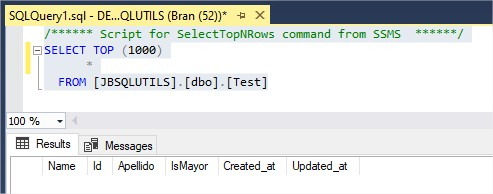

Por default la tabla correspondiente al modelo, incluirá las columnas created_at y update_at

Si deseamos que JBSqlUtils no gestione las columnas created_at y update_at, al momento de crear la tabla,
insertar o actualizar un registro, basta con llamar el método setTimestamps(false), enviando como parametro true
si queremos que JBSqlUtils gestione las columnas o false si queremos que JBSqlUtils No gestione estas columnas.
por default JBSqlUtils esta configurada para manejar la columnas created_at y update_at.
~~~

/**
* Setea la bandera que define si el modelo desea que JBSqlUtils maneje las timestamps Created_at, Update_at.
* @param timestamps True si las timestamps serán manejadas por JBSqlUtils, False, si el modelo no tiene estas
*                   columnas.
*/
test.setTimestamps(false);

/**
* Crea la tabla correspondiente al modelo en BD's si esta no existe.
* @return True si la tabla correspondiente al modelo en BD's no existe y fue creada exitosamente,
* False si la tabla correspondiente al modelo ya existe en BD's
*/
test.crateTable();

~~~

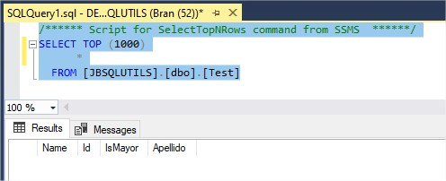

* * *

## ¿Cómo almacenar un modelo en BD's?

Para poder insertar un modelo en la tabla correspondiente al mismo en BD's unicamente necesitamos llamar
al método save(), una vez estemos seguros que el modelo posee la información necesaria para insertar el registro.

~~~

/**
* Asignamos valores a las columnas del modelo, luego llamamos al método save(),
* el cual se encarga de insertar un registro en la tabla correspondiente al modelo con la información del mismo
* si este no existe, de existir actualiza el registro por medio de la clave primaria del modelo.
*/
test.getName().setValor("Jose");
test.getApellido().setValor("Bran");
/**
* En este primer ejemplo no seteamos un valor a la columna IsMayor, para comprobar que el valor
* por default configurado al crear la tabla, se este asignando a la respectiva columna.
*/
test.save();

/**
 * Si queremos utilizar el mismo modelo para insertar otro registro con valores diferentes,
 * es necesario que esperemos a que el modelo no este realizando ninguna tarea, relacionada con lectura o
 * escritura en la BD's, debido a que estas tareas JBSqlUtils las realiza en segundo plano, para no interrumpir
 * el hilo de ejecución principal y entregar un mejor rendimiento, por si necesitamos realizar alguna otra
 * instrucción mientras el modelo esta trabajando en segundo plano. para poder saber si el modelo actualmente esta
 * ocupado, podemos hacerlo a traves del método getTaskIsReady(), el cual obtiene la bandera que indica si
 * la tarea que estaba realizando el modelo ha sido terminada
 * @return True si el modelo actualmente no esta realizando una tarea. False si el modelo esta realizando una tarea
 * actualmente.
 * 
 * De utilizar otro modelo, no es necesario esperar a que el primer modelo este libre.
 * 
 */
while (!test.getTaskIsReady()){

}

/**
* Una vez hemos comprobado que el modelo no esta escribiendo u obteniendo información en segundo plano
* podemos utilizarlo, para insertar otro registro totalmente diferente al que insertamos anteriormente.
*/
test.getName().setValor("Daniel");
test.getApellido().setValor("Quiñonez");
test.getIsMayor().setValor(false);

/**
* Le indicamos a JBSqlUtils que de este segundo registro a insertar, no queremos que maneje
* las columnas created_at y updated_at.
*/
test.setTimestamps(false);

/**
* En este segundo ejemplo si seteamos un valor a la columna IsMayor, ya que no queremos que esta
* tenga el valor configurado por default para esta columna al momento de crear la tabla.
*/
test.save();

~~~

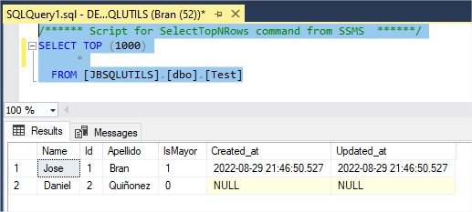

* * *

## ¿Cómo obtener un registro de BD's?

Para obtener un registro de BD's JBSqlUtils proporciona diferentes métodos los cuales veremos a continuación.

### Obtener el registro en el modelo que realiza la búsqueda.

~~~

/**
* Podemos obtener un registro de la tabla correspondiente al modelo en BD's a través del método get()
* el cual llena el modelo que realiza la invocación del método con la información obtenida.
*
* Para poder filtrar la búsqueda y tener acceso al método get(), es necesario que llamemos al método
* where() el cual nos proporciona un punto de entrada para otros métodos, por medio de los cuales podemos
* brindar una lógica un poco más compleja a la búsqueda del registro que deseamos obtener.
*/
test.where("name", Operator.LIKE, "Jos%").and("apellido", Operator.IGUAL_QUE, "Bran").get();

/**
* Esperamos a que el modelo termine de obtener la información de BD's
*/
while (!test.getTaskIsReady()){

}

/**
* Mostramos la información obtenida
*/
LogsJB.info(test.getId().getValor()+"   "+test.getName().getValor()+"   "+test.getApellido().getValor()
    +"   "+test.getIsMayor().getValor()+"   "+test.getCreated_at().getValor()+"   "+test.getUpdated_at().getValor());

~~~

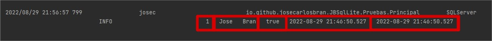

* * *

### Obtener el registro en un modelo diferente al modelo que realiza la búsqueda.

~~~

/**
* Podemos obtener un registro de la tabla correspondiente al modelo en BD's a través del método first()
* el cual obtiene un nuevo modelo del tipo que realiza la invocación del método con la información obtenida,
* unicamente casteamos el resultado al tipo de modelo que recibira la información.
*
* Para poder filtrar la búsqueda y tener acceso al método first(), es necesario que llamemos al método
* where() el cual nos proporciona un punto de entrada para otros métodos, por medio de los cuales podemos
* brindar una lógica un poco más compleja a la búsqueda del registro que deseamos obtener.
*/
Test test2= (Test) test.where("isMayor", Operator.IGUAL_QUE, false).first();

/**
* Esperamos a que el modelo termine de obtener la información de BD's
*/
while (!test.getTaskIsReady()){

}
/**
* Mostramos la información obtenida
*/
LogsJB.info(test2.getId().getValor()+"   "+test2.getName().getValor()+"   "+test2.getApellido().getValor()
    +"   "+test2.getIsMayor().getValor()+"   "+test2.getCreated_at().getValor()+"   "+test2.getUpdated_at().getValor());

~~~

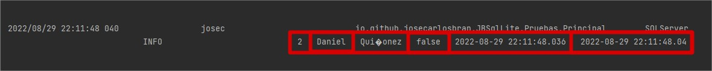

Vemos que la columna created_at y update_at retornan como valor la fecha y hora actual, debido a que en BD's 
estas no poseen un valor, entonces el valor de la columna es Null y por defecto el modelo retorna la fecha y
hora actual.

* * *

### Obtener el registro en un modelo, en caso de no encontrarlo lanzar una excepción.

Si lo que necesitamos es buscar un registro y obtenerlo en un modelo, pero en caso de no existir, deseamos se 
dispare una excepción, podemos utilizar el método firstOrFail(), el cual lanza un ModelNotFound Excepción en caso
de no encontrar el registro para el modelo.

- En el siguiente Ejemplo obtendrá la información para el modelo

~~~

/**
* Podemos obtener un registro de la tabla correspondiente al modelo en BD's a través del método firstOrFail()
* el cual obtiene un nuevo modelo del tipo que realiza la invocación del método con la información obtenida,
* unicamente casteamos el resultado al tipo de modelo que recibira la información.
*
* En caso de no encontrar el registro que se desea obtener lanzara una excepción ModelNotFound, la cual
* nos indicará que no fue posible encontrar la información para el modelo.
*
* Para poder filtrar la busqueda y tener acceso al método firstOrFail(), es necesario que llamemos al método
* where() el cual nos proporciona un punto de entrada para otros métodos, por medio de los cuales podemos
* brindar una lógica un poco más compleja a la busqueda del registro que deseamos obtener.
*/
Test test2= (Test) test.where("Name", Operator.IGUAL_QUE, "Jose").firstOrFail();

/**
* Esperamos a que el modelo termine de obtener la información de BD's
*/
while (!test.getTaskIsReady()){

}
/**
* Mostramos la información obtenida
*/
LogsJB.info(test2.getId().getValor()+"   "+test2.getName().getValor()+"   "+test2.getApellido().getValor()
    +"   "+test2.getIsMayor().getValor()+"   "+test2.getCreated_at().getValor()+"   "+test2.getUpdated_at().getValor());

~~~

Información en BD's SQLite

Información obtenida por el modelo

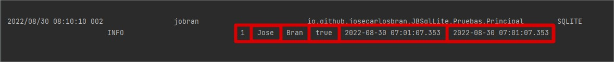

- En el siguiente Ejemplo Lanzara la excepción ModelNotFound

~~~

/**
* Podemos obtener un registro de la tabla correspondiente al modelo en BD's a través del método firstOrFail()
* el cual obtiene un nuevo modelo del tipo que realiza la invocación del método con la información obtenida,
* unicamente casteamos el resultado al tipo de modelo que recibira la información.
*
* En caso de no encontrar el registro que se desea obtener lanzara una excepción ModelNotFound, la cual
* nos indicará que no fue posible encontrar la información para el modelo.
*
* Para poder filtrar la busqueda y tener acceso al método firstOrFail(), es necesario que llamemos al método
* where() el cual nos proporciona un punto de entrada para otros métodos, por medio de los cuales podemos
* brindar una lógica un poco más compleja a la busqueda del registro que deseamos obtener.
*/
Test test2= (Test) test.where("Name", Operator.IGUAL_QUE, "Jose").and("IsMayor", Operator.IGUAL_QUE, false).firstOrFail();

/**
* Esperamos a que el modelo termine de obtener la información de BD's
*/
while (!test.getTaskIsReady()){

}
/**
* Mostramos la información obtenida
*/
LogsJB.info(test2.getId().getValor()+"   "+test2.getName().getValor()+"   "+test2.getApellido().getValor()
    +"   "+test2.getIsMayor().getValor()+"   "+test2.getCreated_at().getValor()+"   "+test2.getUpdated_at().getValor());

~~~

Información en BD's SQLite

Excepción disparada, manejo la excepción para que me muestre la información y causa de la
misma.

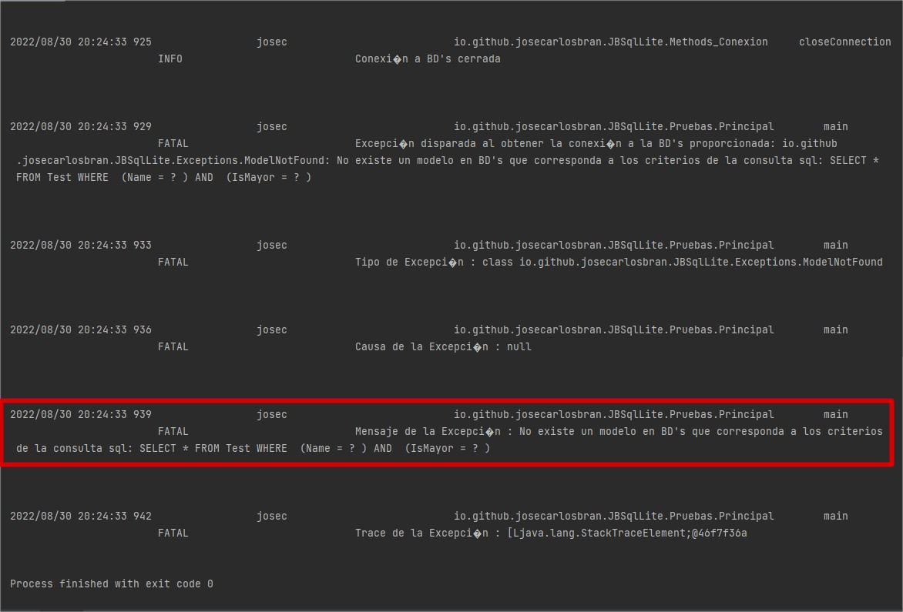

* * *

* * *

## ¿Cómo obtener multiples registros de BD's?

Podemos obtener multiples registros de BD's a través de los siguientes métodos

- Método getALL()

Obtiene una lista de modelos que coinciden con la búsqueda realizada por medio de la consulta SQL
~~~

/**
* Declaramos una lista de modelos del tipo Test, en la cual almacenaremos la información obtenida de BD's'
*/
List<Test> lista=new ArrayList<>();

/**
* Obtenemos todos los registros cuyos Id son mayores a 2, el método getALL()
* Obtiene una lista de modelos que coinciden con la busqueda realizada por medio de la consulta SQL
*/
lista=test.where("id", Operator.MAYOR_QUE, 2).getAll();

/**
* Esperamos a que el modelo termine de obtener la información de BD's
*/
while (!test.getTaskIsReady()){

}

/**
* Declaramos una función anonima que recibira como parametro un obtjeto del tipo Test
* el cual es el tipo de modelo que obtendremos y dentro de esta función imprimiremos
* la información del modelo.
*/
Consumer<Test> showFilas = fila -> {
LogsJB.info(fila.getId().getValor()+"   "+fila.getName().getValor()+"   "+fila.getApellido().getValor()+"   "+fila.getIsMayor().getValor()+"   "+fila.getCreated_at().getValor()+"   "+fila.getUpdated_at().getValor());
};

/**
* Mostramos la información obtenida iterando sobre los modelos obtenidos de BD's y mostrando
* su contenido por medio de la función anonima que declaramos ateriormente.
*/
lista.forEach(showFilas);

~~~

Información en BD's SQLite

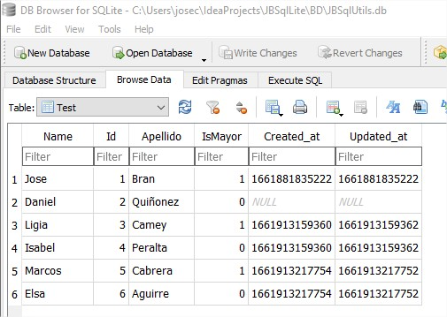

Lista de modelos obtenidos de BD's

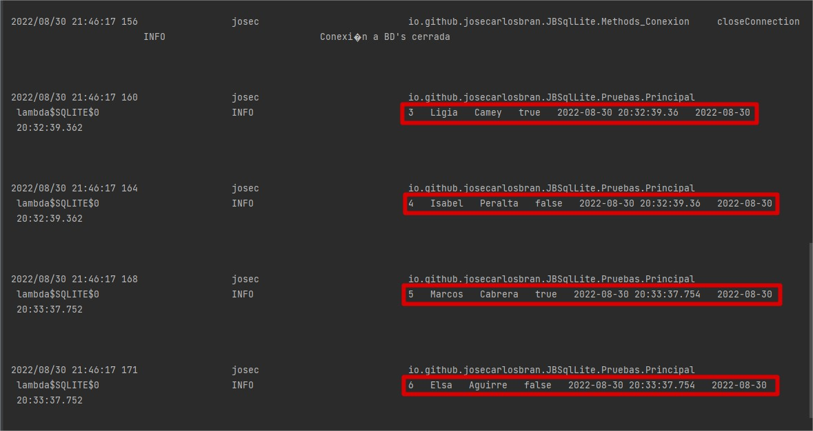

Si deseamos limitar la cantidad de resultados, podemos hacerlo a través del método take(Cantidad).get()
el cual retornara una lista de modelos coincidentes con la consulta SQL menor o igual a la cantidad especificada
en el método take, ya que la cantidad de registros obtenidos, depende de los registros que coinciden en BD's

- Método take()

Obtiene una lista de modelos que coinciden con la búsqueda realizada por medio de la consulta SQL, limitada
por la cantidad de registros especificados en el método take()
~~~

/**
* Declaramos una lista de modelos del tipo Test, en la cual almacenaremos la información obtenida de BD's'
*/
List<Test> lista=new ArrayList<>();

/**
* Obtenemos todos los registros cuyos Id son mayores a 2, el método take(Cantidad).get();
* Obtiene una lista de modelos que coinciden con la búsqueda realizada por medio de la consulta SQL
* limitada a la cantidad de registros especificados en el método take().
*/
lista=test.where("id", Operator.MAYOR_QUE, 2).take(2).get();

/**
* Esperamos a que el modelo termine de obtener la información de BD's
*/
while (!test.getTaskIsReady()){

}

/**
* Declaramos una función anonima que recibira como parametro un obtjeto del tipo Test
* el cual es el tipo de modelo que obtendremos y dentro de esta función imprimiremos
* la información del modelo.
*/
Consumer<Test> showFilas = fila -> {
LogsJB.info(fila.getId().getValor()+"   "+fila.getName().getValor()+"   "+fila.getApellido().getValor()+"   "+fila.getIsMayor().getValor()+"   "+fila.getCreated_at().getValor()+"   "+fila.getUpdated_at().getValor());
};

/**
* Mostramos la información obtenida iterando sobre los modelos obtenidos de BD's y mostrando
* su contenido por medio de la función anonima que declaramos ateriormente.
*/
lista.forEach(showFilas);

~~~

Información en BD's SQLite

Lista de modelos obtenidos de BD's

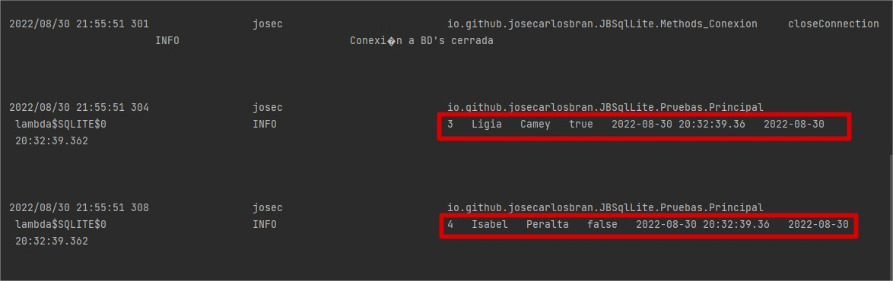

* * *

## ¿Cómo ordenar los registros obtenidos de BD's?

Podemos ordenar los registros que serán obtenidos de BD's por medio del método orderBy()

- Método orderBy()

Ordena los registros obtenidos de BD's de acuerdo a la columna que enviamos como parametro y el 
tipo de ordenamiento que le especificamos.

~~~

/**
* Declaramos una lista de modelos del tipo Test, en la cual almacenaremos la información obtenida de BD's'
*/
List<Test> lista=new ArrayList<>();

/**
* Obtenemos todos los registros cuyos Id son mayores a 2, el metodo orderBy() los ordena de acuerdo a la columna
* que enviamos como parametro y el tipo de ordenamiento que le especificamos.
* El método orderBy() proporciona acceso a todos los métodos que hemos visto anteriormente, los cuales nos
* permiten obtener uno o multiples registros, de acuerdo a la lógica que brindemos a nuestra sentencia SQL.
*/
lista=test.where("id", Operator.MAYOR_QUE, 2).orderBy("id", OrderType.DESC).take(2).get();

/**
* Esperamos a que el modelo termine de obtener la información de BD's
*/
while (!test.getTaskIsReady()){

}

/**
* Declaramos una función anonima que recibira como parametro un obtjeto del tipo Test
* el cual es el tipo de modelo que obtendremos y dentro de esta función imprimiremos
* la información del modelo.
*/
Consumer<Test> showFilas = fila -> {
LogsJB.info(fila.getId().getValor()+"   "+fila.getName().getValor()+"   "+fila.getApellido().getValor()+"   "+fila.getIsMayor().getValor()+"   "+fila.getCreated_at().getValor()+"   "+fila.getUpdated_at().getValor());
};

/**
* Mostramos la información obtenida iterando sobre los modelos obtenidos de BD's y mostrando
* su contenido por medio de la función anonima que declaramos ateriormente.
*/
lista.forEach(showFilas);

~~~

Información en BD's SQLite

Lista de modelos obtenidos de BD's

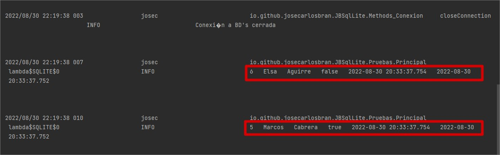

* * *

## ¿Cómo obtener JBSqlUtils para usarlo en mi proyecto?

Puedes obtener la librería JBSqlUtils de la siguiente manera

Maven

~~~
<dependency>
    <groupId>io.github.josecarlosbran</groupId>
    <artifactId>JBSqlUtils</artifactId>
    <version>1.0</version>
</dependency>
~~~

Gradle

~~~
implementation 'io.github.josecarlosbran:JBSqlUtils:1.0'
~~~

Para mayor información sobre como descargar JBSqlUtils desde otros
administradores de paquetes, puedes ir al siguiente Link
<https://search.maven.org/artifact/io.github.josecarlosbran/JBSqlUtils>

***

## Licencia :balance_scale:

JBSqlUtils es una librería open source desarrollada por José Bran, para la administración
de los registros de un programa, con licencia de Apache License, Versión 2.0;

No puede usar esta librería excepto de conformidad con la Licencia.
Puede obtener una copia de la Licencia en http://www.apache.org/licenses/LICENSE-2.0

A menos que lo exija la ley aplicable o se acuerde por escrito, el software
distribuido bajo la Licencia se distribuye "TAL CUAL",
SIN GARANTÍAS NI CONDICIONES DE NINGÚN TIPO, ya sean expresas o implícitas.
Consulte la Licencia para conocer el idioma específico que rige los permisos y
limitaciones bajo la Licencia.

***
