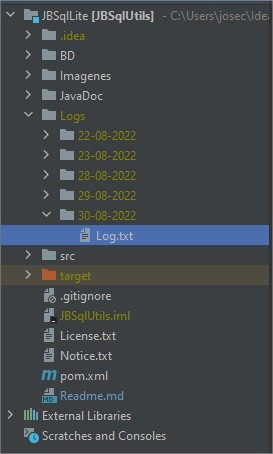

# JBSqlUtils :computer:

JBSqlUtils es un ORM desarrollado en java por José Carlos Alfredo Bran Aguirre, 
que permite gestionar BD's SQLite, MySQL, PostgreSQL y SQLServer, de una manera fácil 
y rápida sin interrumpir la ejecución del hilo principal del programa, lo cual la hace un potente ORM, 
por medio del cual tendrá acceso a un CRUD, configurando únicamente la conexión del
modelo, los atributos que posee la tabla en BD's cómo variables que pertenecerán al modelo en su aplicación.

JBSqlUtils también proporciona un potente generador de instrucciones SQL que le permitirá crear 
o eliminar una tabla, insertar, seleccionar, actualizar o eliminar registros de una tabla 
en su BD's sin necesidad de instanciar un modelo cómo tal, únicamente tendrá que configurar previamente
la conexión a su BD's.
* * *

## Estado del Proyecto :atom:

JBSqlUtils actualmente está en una etapa de desarrollo continuo, por lo cual sus 
observaciones y recomendaciones, son bienvenidas para mejorar el proyecto.

***
## Configuración :gear:

[Configuración Global](ConfigJBSqlUtils.md)

[Configuración de Modelos](ConfigJBSqlUtilsForModels.md)
***

## ¿Desarrollando con JBSqlUtils? :running:

[Utilizar JBSqlUtils cómo un generador de instrucciones SQL](JBSqlUtilsWithOutModels.md)

[Utilizar Modelos](JBSqlUtilsForModels.md)

***

## ¿A que Test se ha sometido JBSqlUtils?
Puede revisar los resultados de los Test a los que se ha sometido JBSqlUtils en el siguiente enlace

[Test Result](src/test/TestResult.md)

* * *

## ¿Cómo poder hacer un seguimiento de lo que sucede dentro de JBSqlUtils?

JBSqlUtils utiliza la librería LogsJBSupport, para el registro de todo lo que sucede al momento
de realizar una inserción, actualización, consulta o eliminar un registro en BD's, por default se
registra toda aquella actividad de nivel INFO y superior, si desea debuggear o modificar el nivel
de log que reporta JBSqlUtils será necesario que importe en su proyecto la librería LogsJBSupport y
llame al método LogsJB.setGradeLog(), enviando cómo parametro el grado de Log, desde el cual
desea que JBSqlUtils registre su actividad.

Puedes obtener la librería LogsJBSupport de la siguiente manera

Maven

~~~
<!-- Dependencia para el manejo de los Logs -->
    <dependency>
        <groupId>io.github.josecarlosbran</groupId>
        <artifactId>LogsJBSupport</artifactId>
        <version>0.5.4</version>
        <scope>compile</scope>
    </dependency>
~~~

Gradle

~~~
implementation 'io.github.josecarlosbran:LogsJBSupport:0.5.1'
~~~

Modificar el Nivel de Log que queremos tener sobre JBSqlUtils

~~~
/***
* Setea el NivelLog desde el cual deseamos se escriba en el Log de la aplicación actual.
* @param GradeLog Nivel Log desde el cual hacía arriba en la jerarquia de logs, deseamos se reporten
*   * Trace = 200,
*   * Debug = 400,
*   * Info = 500,
*   * Warning = 600,
*   * Error = 800,
*   * Fatal = 1000.
* El valor por defaul es Info. Lo cual hace que se reporten los Logs de grado Info, Warning, Error y Fatal.
*/
LogsJB.setGradeLog(NivelLog.INFO);
~~~

Encontraremos los Logs de JBSqlUtils en el directorio de nuestra aplicación en ejecución, se creará la carpeta
Logs, dentro de la cual se creara una carpeta por cada día y dentro de la misma se almacenaran los Logs de la
aplicación, para mayor información visitar el siguiente Link

[LogsJB](https://github.com/Jbranadev/LogsJB/blob/support_version/Readme.md)

* * *

## ¿Cómo obtener JBSqlUtils para usarlo en mi proyecto?

Puedes obtener la librería JBSqlUtils de la siguiente manera

Maven

~~~
<dependency>
  <groupId>io.github.josecarlosbran</groupId>
  <artifactId>JBSqlUtils</artifactId>
  <version>1.1.5.6</version>
</dependency>
~~~

Gradle

~~~
implementation 'io.github.josecarlosbran:JBSqlUtils:1.1.5.6'
~~~

Para mayor información sobre cómo descargar JBSqlUtils desde otros
administradores de paquetes, puedes ir al siguiente Link
[JBSqlUtils](https://search.maven.org/artifact/io.github.josecarlosbran/JBSqlUtils)

***

## Licencia :balance_scale:

JBSqlUtils es un ORM open source desarrollado por José Bran, para gestionar BD's SQLite,
MySQL, PostgreSQL y SQLServer, de una manera fácil y rápida, con licencia de Apache License, Versión 2.0;

No puede usar este ORM excepto de conformidad con la Licencia.
Puede obtener una copia de la Licencia en http://www.apache.org/licenses/LICENSE-2.0

A menos que lo exija la ley aplicable o se acuerde por escrito, el software
distribuido bajo la Licencia se distribuye "TAL CUAL",
SIN GARANTÍAS NI CONDICIONES DE NINGÚN TIPO, ya sean expresas o implícitas.
Consulte la Licencia para conocer el idioma específico que rige los permisos y
limitaciones bajo la Licencia.

***
