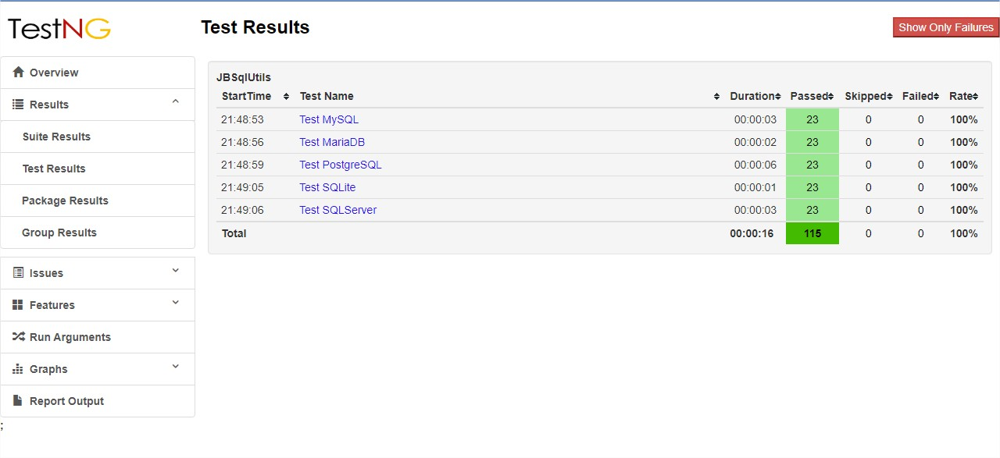
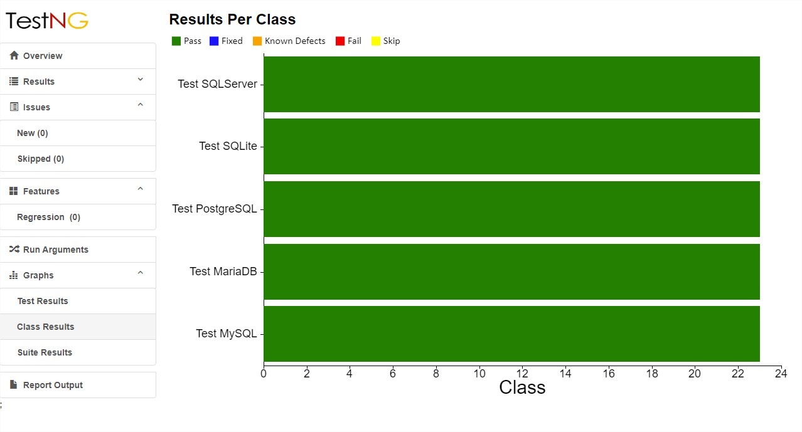

# Test JBSqlUtils

JBSqlUtils se ha sometido a Test que garanticen el correcto funcionamiento de los métodos
que pone a disposición de sus usuarios, para ello utiliza TestNG y ReportNG para la visualización
de los resultados.

Esta es la pagina principal del reporte de Test, en la cual se pueden visualizar
que JBSqlUtils se ha sometido a 115 Test's
[Results](https://jbranadev.github.io/JBSqlUtilsTest.github.io/html/index.html)

Resultados de los Test ejecutados

[23 Test en MySQL](https://jbranadev.github.io/JBSqlUtilsTest.github.io/html/suite1_test1_results.html)

Puede encontrar el codigo fuente en el siguiente enlace:
[Test MySQL](https://github.com/Jbranadev/JBSqlUtils/blob/master/src/test/java/io/github/josecarlosbran/JBSqlUtils/JBSqlUtilsTestMySQL.java)

[23 Test en MariaDB](https://jbranadev.github.io/JBSqlUtilsTest.github.io/html/suite1_test2_results.html)

Puede encontrar el codigo fuente en el siguiente enlace:
[Test MariaDB](https://github.com/Jbranadev/JBSqlUtils/blob/master/src/test/java/io/github/josecarlosbran/JBSqlUtils/JBSqlUtilsTestMariaDB.java)

[23 Test en PostgreSQL](https://jbranadev.github.io/JBSqlUtilsTest.github.io/html/suite1_test3_results.html)

Puede encontrar el codigo fuente en el siguiente enlace:
[Test PostgreSQL](https://github.com/Jbranadev/JBSqlUtils/blob/master/src/test/java/io/github/josecarlosbran/JBSqlUtils/JBSqlUtilsTestPostgreSQL.java)

[23 Test en SQLite](https://jbranadev.github.io/JBSqlUtilsTest.github.io/html/suite1_test4_results.html)

Puede encontrar el codigo fuente en el siguiente enlace:
[Test SQLite](https://github.com/Jbranadev/JBSqlUtils/blob/master/src/test/java/io/github/josecarlosbran/JBSqlUtils/JBSqlUtilsTestSQLite.java)

[23 Test en SQLServer](https://jbranadev.github.io/JBSqlUtilsTest.github.io/html/suite1_test5_results.html)

Puede encontrar el codigo fuente en el siguiente enlace:
[Test SQLServer](https://github.com/Jbranadev/JBSqlUtils/blob/master/src/test/java/io/github/josecarlosbran/JBSqlUtils/JBSqlUtilsTestSQLServer.java) 

